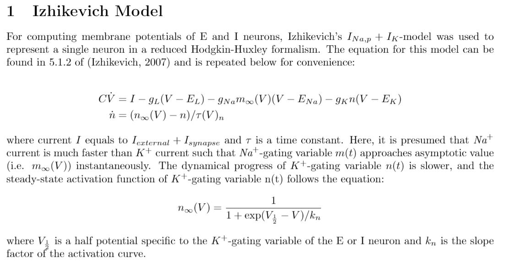
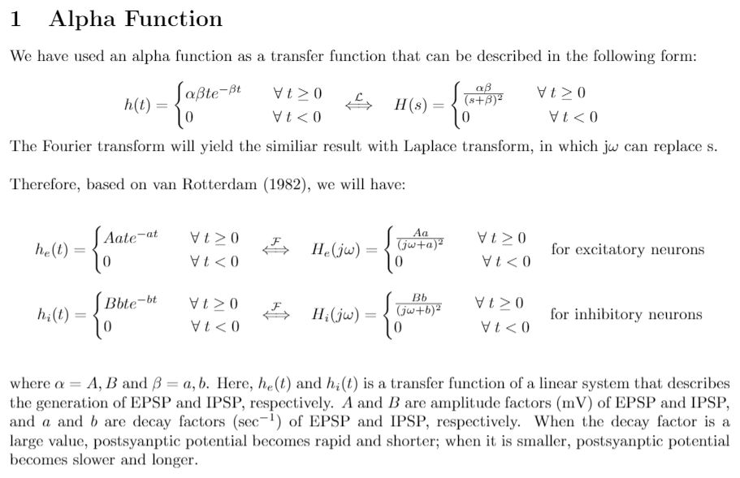
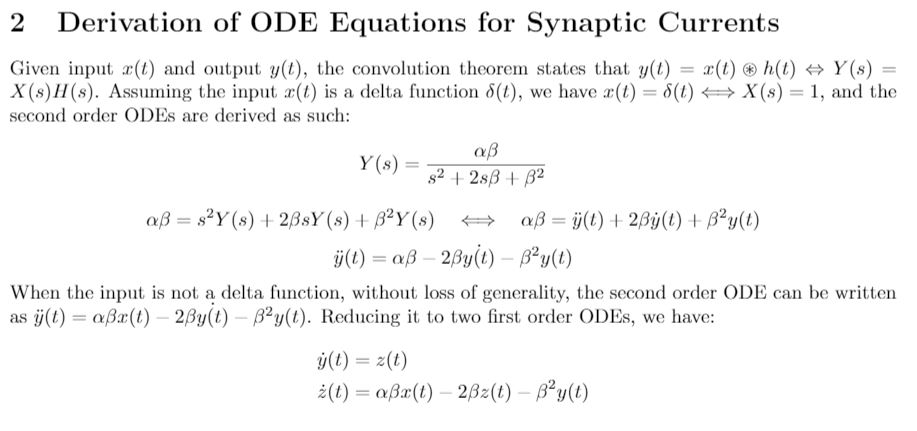

## Theoretical Modeling and Simulation of Ictal Wave Propagation
### Objective
The objective of this project is to simulate a focal seizure propagation that is characterized by paroxysmal depolarizing shift (PDS) by computing theoretical network models of pyramidal excitatotry (E) neurons and parvalbumin inhibitory (I) neurons.

### Description
The MATLAB code 'propagation_simulation.m' simulates a ictal wave propagation of a simple feedfoward network, in which an excessive external input leads to the saturation of parvalbumin I neurons (i.e. PDS) and results in propagation of strong excitatory activities across the neural population. Although both E and I neurons can be subjected to saturation, the ictal wave population is characterized by series of PDS following faster exhaustion of inhibition and subsequent hyperexcitation in E neurons.

#### Equation 1: Single Neuron Membrane Potential
Note: Following equations are derived from E.M. Izhikevich (2007). For further reference, please find Chapter 5 of "Dynamical Systems in Neuroscience" (MIT Press) by Izhikevich.  

Reference:  
[1] E.M. Izhikevich. (2007). Dynamical Systems in Neuroscience: The Geometry of Excitability and Bursting. MIT Press.

#### Equation 2: Synaptic Current of E and I Neurons
Note: Following equations were derived from van Drongelen (2018) and van Rotterdam (1982).  

Reference:  
[1] A. van Rotterdam, F.H. Lopes da Silva, J. van den Ende, M.A. Viergever, & A.J. Hermans. (1982). A model of the spatial-temporal characteristics of the alpha rhythm. Bulletin of Mathematical Biology, 44 (2): 283-305.  
[2] W. van Drongelen. (2018). Signal Processing for Neuroscientists, 2nd Edition. Academic Press.

#### Video: 'ictal_propagation_test1.avi'
The ideal speed of seizure propagation is 1mm /sec. Since it was presumed that 40 neurons reside in 1mm space, a ictal wave propagation across 1 neuron takes 25 ms. In this video, a delay time from one neuron to another (i.e. a propagation time across a single neuron) was 27.9 ms where time step was 1/1000. Video features 80 E neurons and 80 I neurons, and extra external currents were added to each neuron under the presumption that there will be input activities of surrounding neighbor neurons that affect our calculation but are not included in our mathematical model. Lastly, the shortness of video is due to the limited computing power available at the time of running simulation. Longer videos will be updated once available.

#### Requirement
MATLAB R2018b

### Acknowledgement
The following codes were written under the supervision of Professor van Drongelen at the University of Chicago Department of Pediatrics and Neurology and with the advise of Tuan Pham.
