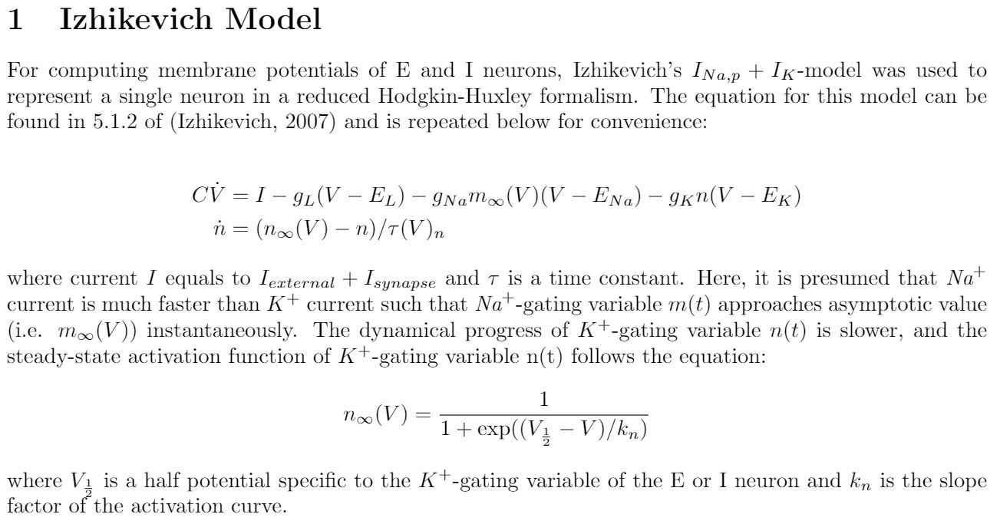

## Theoretical Modeling and Simulation of Ictal Wave Propagation
### Objective
The objective of this project is to simulate a propagating focal seziure wave that is characterized by paroxysmal depolarizing shift (PDS) by modeling a theoretical network model of excitatotry (E) neurons and inhibitory (I) neurons.

### Description
The MATLAB codes necessary for running the simulation are located in the folder '[simulation](https://github.com/scho20/focal_seizure_propagation/blob/master/simulation)'. Four codes are available for different types of simulation.  
1. '[Final_IdealPropagation_311.m](https://github.com/scho20/focal_seizure_propagation/blob/master/simulation/thesis_codes/Final_IdealPropagation_311.m)' simulates an ideal ictal wave propagation of a simple ictal feedforward network, in which an excessive excitatory input leads to the saturation of parvalbumin I neurons (i.e. PDS) and results in propagation of strong excitatory activities across the neural population. Here, the additional input from the neighboring cellular population was made ideal by subtracting the postsynaptic current values of the ictal neurons from the total expected current values.  
2. '[Final_ArtificialInput_311.m](https://github.com/scho20/focal_seizure_propagation/blob/master/simulation/thesis_codes/Final_ArtificialInput_311.m)' simulates an ictal wave propagation of an ictal feedforward network by adding the neighboring input currents that are artificially made to have a waveform similar to that of external input currents.  
3. '[Final_IctalNetwork_312.m](https://github.com/scho20/focal_seizure_propagation/blob/master/simulation/thesis_codes/Final_IctalNetwork_312.m)' and '[Final_NeighboringNetworkMotif_312.m](https://github.com/scho20/focal_seizure_propagation/blob/master/simulation/thesis_codes/Final_NeighboringNetworkMotif_312.m)' together simulate an ictal wave propagation of an ictal feedforward network by adding the additional input currents computed from the dynamic network of the neighboring neuronal motif.

#### Equation 1: Single Neuron Membrane Potential
Note: Following equations are derived from E.M. Izhikevich (2007). For further reference, please find Chapter 5 of "Dynamical Systems in Neuroscience" (MIT Press) by Izhikevich.  

Reference:  
[1] E.M. Izhikevich. (2007). Dynamical Systems in Neuroscience: The Geometry of Excitability and Bursting. MIT Press.

#### Equation 2: Synaptic Current of E and I Neurons
Note: Following equations were derived from van Drongelen (2018) and van Rotterdam (1982).  

Reference:  
[1] A. van Rotterdam, F.H. Lopes da Silva, J. van den Ende, M.A. Viergever, & A.J. Hermans. (1982). A model of the spatial-temporal characteristics of the alpha rhythm. Bulletin of Mathematical Biology, 44 (2): 283-305.  
[2] W. van Drongelen. (2018). Signal Processing for Neuroscientists, 2nd Edition. Academic Press.

#### Videos: 'ictal_propagation_dynamic' & 'ictal_propagation_ideal'
Two videos of simulation can be found at '[videos](https://github.com/scho20/forcal_seizure_propagation/blob/master/simulation/videos)'. First video presents the result from the codes on Description #3, and the second video shows the result from the code on Description #1.

#### Requirement
MATLAB R2018b

### Acknowledgement
The following codes were written under the supervision of Professor Wim van Drongelen and with the advise of Tuan Pham. This project was conducted at the Epilepsy Lab, The University of Chicago.
